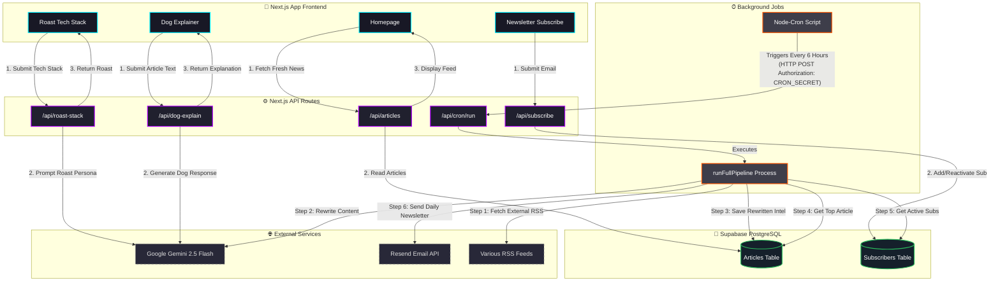

# AI Platform Architecture Flowchart

Below is the complete architectural flowchart for your AI News & Toolkit platform, covering the Next.js frontend, backend API routes, the background Cron job data pipeline, and external services.

